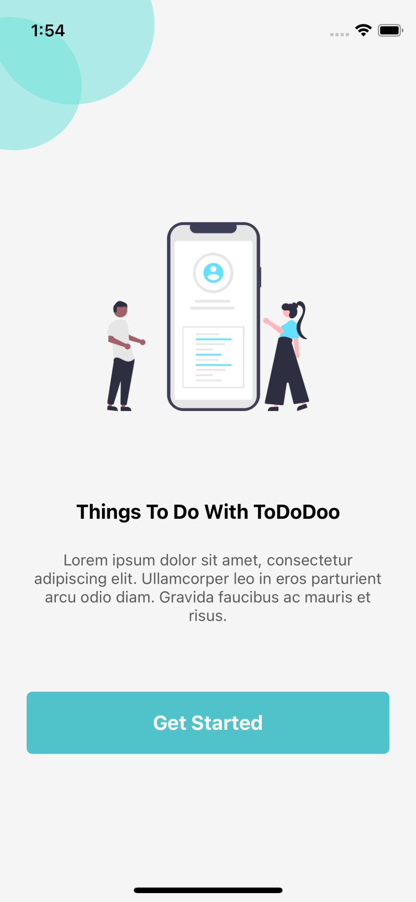
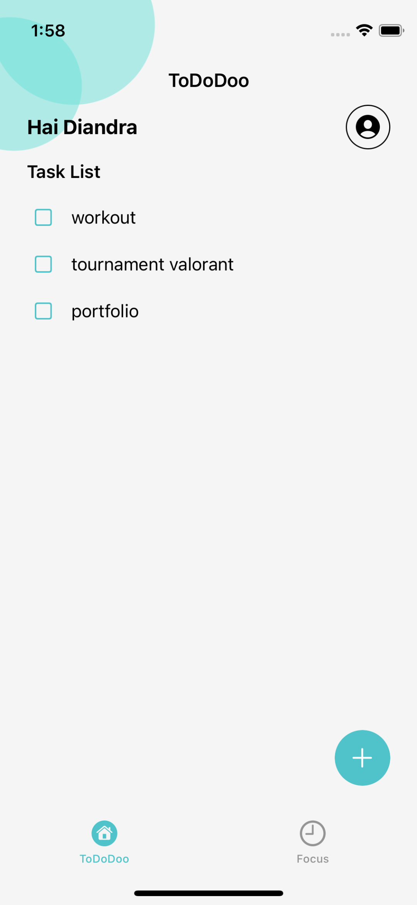
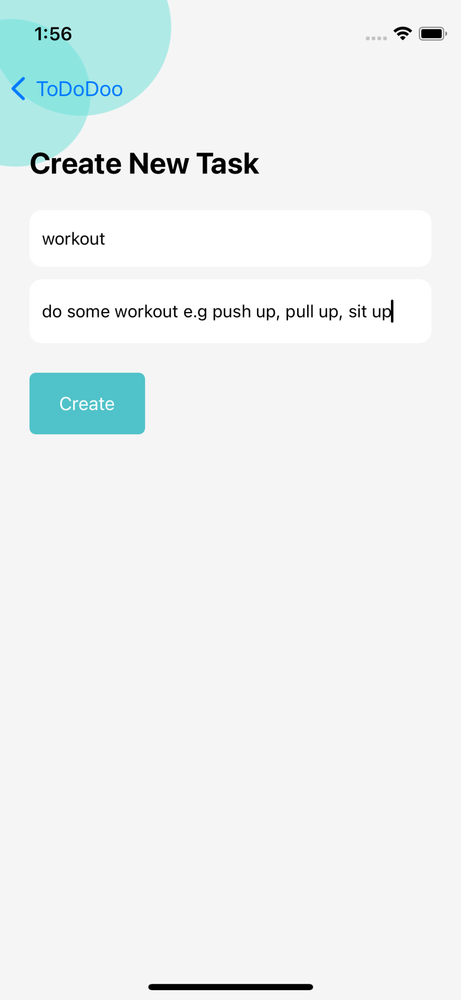
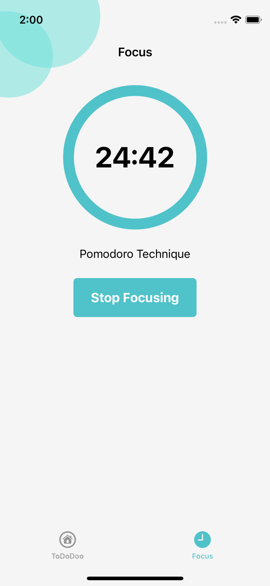

# ToDoDoo iOS App #
ToDoDoo is a task management application to help users stay organized, this app uses core data as local storage, which can add tasks, delete tasks, and edit tasks. 
equipped with a pomodoro technique timer so users can focus more

### Screenshots ###
   

### Tech ###
* [Swift](https://developer.apple.com/swift/)
* [UIKit](https://developer.apple.com/documentation/uikit)
* [CoreData](https://developer.apple.com/documentation/coredata)
* [Firebase Auth](https://firebase.google.com)
